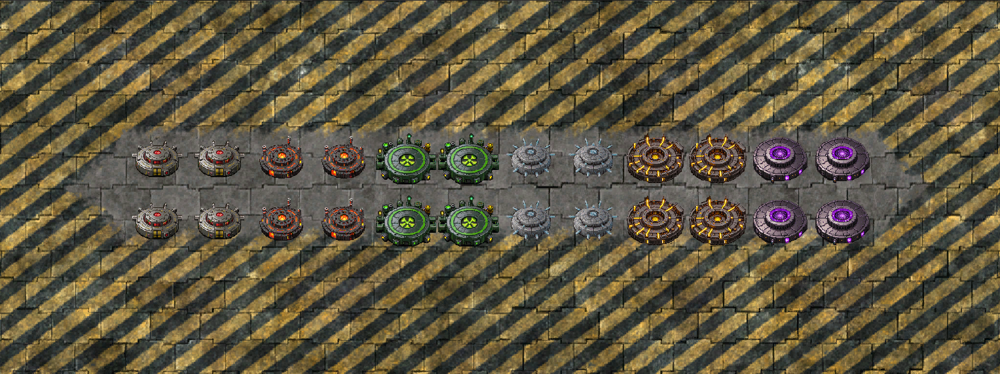

# Jumping Mines

Mod for Factorio - https://mods.factorio.com/mod/jumping-mines

Mines that auto-detect enemies and launch an explosive projectile at the nearest target.

## Mine Types

| Mine | Damage | Radius | Requires |
|------|--------|--------|----------|
| Jumping Mine | 250 explosion | 4 | Military tech |
| Flame Mine | 100 fire + slow | 5 | Flammables |
| Nuclear Mine | 5000 explosion | 15 | Atomic Bomb |
| Cryo Mine *(SE)* | 200 cold + freeze | 4 | Space Exploration |
| Tritium Mine *(SE/K2)* | 5000 explosion + 5000 radiation | 20 | Thermonuclear research |
| Antimatter Mine *(SE)* | 12500 explosion + 12500 radiation | 25 | Antimatter production |

## Features

- Mines auto-detect the nearest enemy within range and jump toward it
- Ghost entity created on death for automatic robot re-placement
- **Persistent Mode** - mines survive firing and reload (toggle via shortcut button)
- Compatible with **landmine-thrower** mod (shoot mines via flares)
- Compatible with **Space Exploration** and **Krastorio 2**

## Upgrades (via research)

- **Detection Range** - 10 levels, +2 tiles each (base 5 to max 25)
- **Arming Speed** - 9 levels, base 1.0s to min 0.1s
- **Reload Cooldown** - 9 levels (Persistent Mode only)